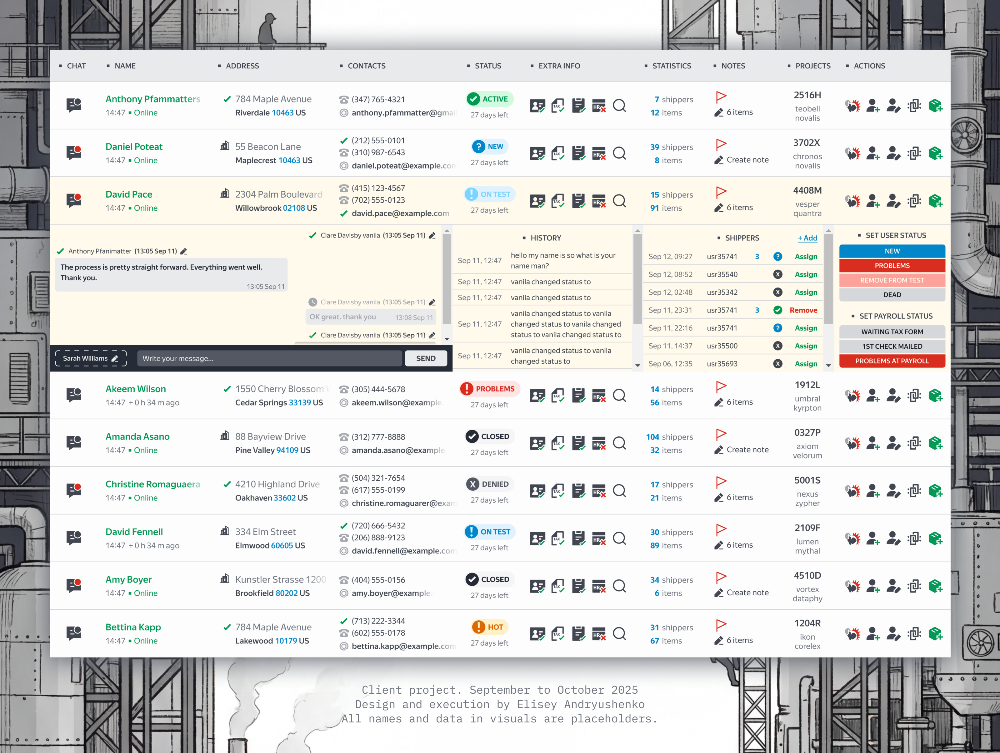

  

<h1 align="center">Fulfillment Dashboard Redesign</h1>

  Client project · Sep–Oct 2025 · Design by <b>Elisey Andryushenko</b>

  All names and data in visuals are placeholders.

 

  <a href="#why-it-needed-a-redesign">Why it needed a redesign</a>
  ·
  <a href="#the-core-idea">The core idea</a>
  ·
  <a href="#turning-the-table-into-a-map">Turning the table into a map</a>
  ·
  <a href="#working-style-and-delivery">Working style and delivery</a>

---

## Why it needed a redesign

The original experience had the classic operations problem. Too many things mattered, and everything tried to shout at the same volume. People were doing support in one place, checking docs in another, updating statuses elsewhere, then coming back to rebuild context from memory.

That is expensive. Not “in theory” expensive. It costs minutes per case, it creates wrong clicks, and it makes even experienced operators feel tired earlier than they should.

So I designed this page like a control room. High density, but calm. A lot of information, but arranged so the eye always knows where to land next.

  

---

## The core idea

A fulfillment operator needs two modes. A wide view to find the right person fast. A deep view to resolve the case without losing the thread. This layout supports both without turning into “two separate pages”.

The top area is a grid built for scanning. The bottom area becomes the workspace for the selected row. It is still the same screen, still the same context. Selection is not a navigation event, it’s a focus event.

  

---

## Turning the table into a map

Most tables fail because they treat every column as equal. Real work does not. Some fields answer “who is this”, others answer “what is happening”, and a third group answers “what can I do right now”.

Here, identity and reachability are immediately legible. Name, address, contacts. Status is not buried, it’s a strong visual anchor. Secondary metadata stays secondary, but still accessible, so the interface doesn’t become a scavenger hunt.

The grid stays clean even with lots of rows because the hierarchy is consistent. You can skim it at speed and still trust what you’re seeing.

  

---

## Working style and delivery

This was a real client project delivered on a real deadline. I handled the work end to end, from structure and interaction logic to the final UI and component-level decisions, with a focus on making the screen usable under pressure.

The result is a single-page workspace that supports speed without sacrificing clarity, and density without sacrificing breathing room. It’s the kind of screen you can live in for hours and still feel in control.

  

